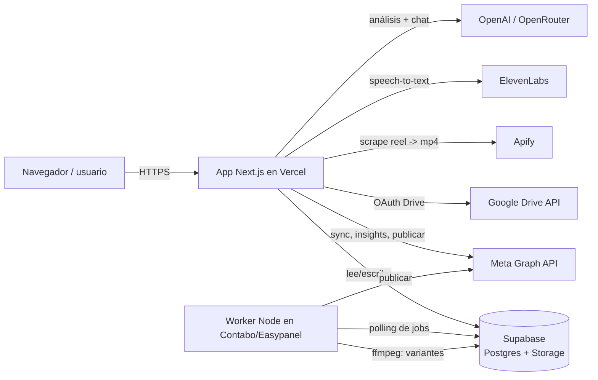

# Informe del sistema — Crevy Content + Crevy Studio

> Documento de referencia ("precedente"): qué es el sistema, cómo está armado, y
> **el requerimiento mínimo** para hacerlo funcionar de cero — APIs, tokens,
> bases de datos e infraestructura. Última actualización: 2026-07-30.

---

## 1. Qué es

Un dashboard personal de inteligencia y producción de contenido para Instagram.
Dos grandes bloques:

- **Crevy Content** — métricas de la cuenta, análisis con IA, inspiración
  (reels de la competencia), chat con IA sobre tu contenido.
- **Crevy Studio** — producción: editor de **Historias** (9:16), generador de
  **Variantes** de video (para testear cuál rinde), y **Calendario** de publicación.

---

## 2. Arquitectura



**Idea clave:** la app de Vercel y el worker del VPS **no se hablan directo**.
Se comunican **solo a través de Supabase**: la app escribe "jobs" en tablas, el
worker los lee, los procesa y escribe el resultado de vuelta. Ambos comparten las
mismas credenciales de Supabase.

### Componentes

| Componente | Dónde corre | Rol |
| --- | --- | --- |
| **App web** (Next.js 16, App Router) | Vercel (rama `main` → producción) | UI, APIs internas, escribe jobs en Supabase |
| **Base de datos + Storage** | Supabase | Postgres (datos) + bucket `studio` (videos/imágenes) |
| **Worker** | Contabo VPS vía Easypanel (Docker) | Genera variantes con ffmpeg y publica en Instagram |

Dominio de producción: **`https://tony-dashboard-psi.vercel.app`**
(⚠️ `tony-dashboard.vercel.app` sin `-psi` es un proyecto viejo, no usar).
Repo: `github.com/antonioalen07/tony-dashboard`.

---

## 3. Requerimiento mínimo para que funcione

### 3.1 Infraestructura

1. **Cuenta de Vercel** con el repo conectado. Deploya la rama `main` a producción.
2. **Proyecto de Supabase** (plan free alcanza para empezar) con:
   - Las tablas creadas (ver §3.3) — correr `supabase_migration_studio.sql`.
   - El bucket **`studio`** público, con políticas anon (lo crea la misma migración).
3. **VPS (Contabo) con Easypanel** para el worker — solo si se usan **Variantes**
   y **publicación automática**. Es un *App service* Docker, sin puerto ni dominio.

### 3.2 APIs y tokens externos

| Servicio | Para qué | Credenciales | ¿Obligatorio? |
| --- | --- | --- | --- |
| **Supabase** | Base de datos + Storage | `NEXT_PUBLIC_SUPABASE_URL`, `NEXT_PUBLIC_SUPABASE_ANON_KEY` | **Sí** (núcleo) |
| **Meta Graph API** | Sync de reels, métricas, audiencia, publicar | `META_APP_ID`, `META_APP_SECRET`, `META_ACCESS_TOKEN`, `META_IG_ACCOUNT_ID` | Sí para Instagram |
| **Apify** | Bajar el mp4 real de un reel (scraper) | `APIFY_API_TOKEN` | Sí para transcribir / variantes desde reel |
| **ElevenLabs** | Transcripción de audio (Scribe / STT) | `ELEVENLABS_API_KEY` | Sí para transcribir |
| **OpenAI** *o* **OpenRouter** | Análisis con IA + chat | `OPENAI_API_KEY` *o* `OPENROUTER_API_KEY` | Sí para IA (uno de los dos) |
| **Google Drive OAuth** | Importar fotos de fondo a Historias | `GOOGLE_CLIENT_ID`, `GOOGLE_CLIENT_SECRET`, `GOOGLE_REDIRECT_URI` | Opcional (solo Historias) |

**Notas sobre tokens:**
- **Meta** es el más delicado: el `META_ACCESS_TOKEN` de usuario **vence a los ~60
  días**. Solución durable: usar un **page access token** (no expira) o un **System
  User token** del Business Manager. Hay un helper: `GET /api/meta/token` (logueado)
  renueva y devuelve el token nuevo para pegar en Vercel. Ver §5.
- La `ANON_KEY` de Supabase es **pública por diseño** (va al navegador). La protección
  real son las políticas RLS. El secret de Meta y el `service_role` **nunca** se exponen.

### 3.3 Base de datos (Supabase Postgres)

Tabla existente previa: **`reels`** (contenido sincronizado de Instagram).

Tablas del Studio (las crea `supabase_migration_studio.sql`, idempotente):

| Tabla | Para qué |
| --- | --- |
| `media_assets` | Imágenes/videos subidos o importados (apuntan al bucket `studio`) |
| `story_projects` | Secuencias de Historias (slides 9:16 con capas) |
| `variant_jobs` | Cola de generación de variantes (la procesa el worker) |
| `video_variants` | Variantes generadas (cada una → un asset de video) |
| `publish_queue` | Cola de publicación (calendario → la levanta el publicador) |
| `google_tokens` | Tokens de Google Drive (fila única) |

**Storage:** bucket **`studio`** (público). Plan free: **50 MB por archivo** (tope
duro) y **500 MB** por bucket. Los uploads grandes desde la PC se **comprimen en el
navegador** (ffmpeg.wasm) antes de subir. Los reels de Instagram son chicos y entran.

### 3.4 Variables de entorno (resumen)

En **Vercel** (app) van todas menos las del worker. En **Easypanel** (worker) van
solo las de Supabase (+ opcionales del worker). Copiar desde `.env.example`.

```
# Núcleo
NEXT_PUBLIC_SUPABASE_URL
NEXT_PUBLIC_SUPABASE_ANON_KEY
# IA (uno)
OPENAI_API_KEY | OPENROUTER_API_KEY
# Instagram
META_APP_ID / META_APP_SECRET / META_ACCESS_TOKEN / META_IG_ACCOUNT_ID
# Reels -> mp4 y transcripción
APIFY_API_TOKEN / ELEVENLABS_API_KEY
# Historias (opcional)
GOOGLE_CLIENT_ID / GOOGLE_CLIENT_SECRET / GOOGLE_REDIRECT_URI
# Acceso al dashboard
AUTH_USERS / AUTH_SECRET
# Worker (Easypanel)
NEXT_PUBLIC_SUPABASE_URL / NEXT_PUBLIC_SUPABASE_ANON_KEY / PUBLISH_DRY_RUN / WORKER_POLL_MS
```

---

## 4. Cómo se construyó (stack)

- **Frontend/Backend:** Next.js 16 (App Router; el middleware se llama `src/proxy.ts`),
  React 19, TypeScript, CSS Modules con tokens de diseño en `globals.css`
  (tema oscuro glass "Cinematic Precision", acento indigo `#5E6BFF`, Manrope + Inter).
- **Auth:** login propio por cookie firmada (`AUTH_USERS`/`AUTH_SECRET`), `proxy.ts`
  bloquea todo salvo `/login` y protege las APIs con 401.
- **Studio – Historias:** editor canvas 9:16 (`storyRender.ts`), capas de texto,
  overlays, dibujos, import desde Drive, autosave en localStorage.
- **Studio – Variantes:** la app sube/elige un video base y crea un `variant_jobs`.
  El **worker** lo toma, genera N variantes con **ffmpeg** (saturación, contraste,
  trim, velocidad, zoom) y las guarda.
- **Worker:** proceso Node de polling (sin puerto), Docker `node:22-slim`
  (Node 22 es obligatorio: `@supabase/supabase-js` usa WebSocket nativo). Jobs
  autónomos en `worker/jobs/*.mjs`.

---

## 5. Operación y mantenimiento

- **Renovar token de Meta (antes de los ~60 días):** logueado, abrir
  `/api/meta/token` en el navegador → copiar el `page_access_token` (no expira) o el
  `long_lived_user_token` a `META_ACCESS_TOKEN` en Vercel → **Redeploy**. Mejor aún:
  migrar a un **System User token** (Business Manager) que no expira.
- **Publicación segura:** el worker arranca con `PUBLISH_DRY_RUN=1` → **NO** publica en
  Instagram, solo loguea. Cuando todo el flujo está validado, se quita esa variable.
- **Storage:** limpiar variantes viejas cada tanto (tope 500 MB en plan free).
- **Miniaturas de reels rotas:** las URLs de Instagram vencen → re-sincronizar.
- **Deploy del worker:** `push` a `main` + **Deploy** en Easypanel. Verificar en los
  logs: `Worker arriba. Jobs: publisher@…, variants@…`.

---

## 6. Checklist mínimo para levantar de cero

1. [ ] Crear proyecto Supabase → correr `supabase_migration_studio.sql`.
2. [ ] Conseguir credenciales: Supabase, Meta (app + token), Apify, ElevenLabs, OpenAI.
3. [ ] Cargar todas las env en Vercel + conectar el repo → deploy de `main`.
4. [ ] Registrar el `GOOGLE_REDIRECT_URI` de producción en Google Cloud Console (si se usa Drive).
5. [ ] (Opcional, para Variantes/publicar) Desplegar `worker/` en Easypanel con las env de Supabase + `PUBLISH_DRY_RUN=1`.
6. [ ] Validar: login → sync de reels → análisis IA → crear una variante → ver el worker procesarla.
