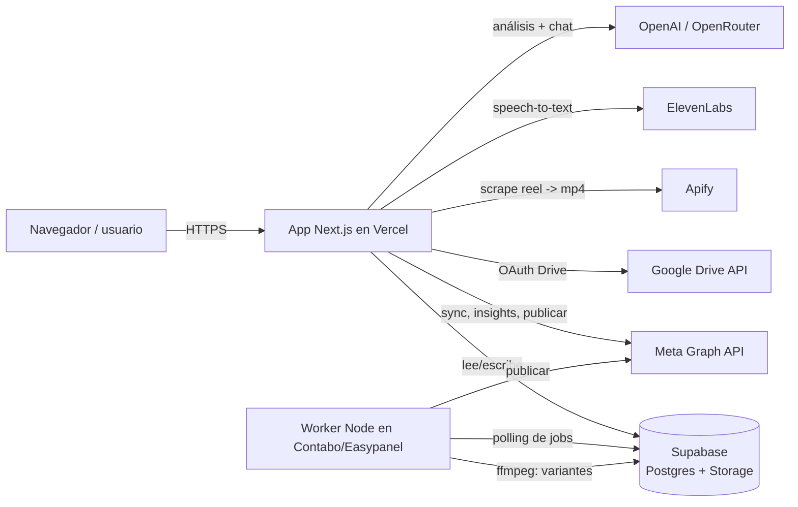

# Informe del sistema — Crevy Content + Crevy Studio

> Documento de referencia ("precedente"): qué es el sistema, cómo está armado, y
> **el requerimiento mínimo** para hacerlo funcionar de cero — APIs, tokens,
> bases de datos e infraestructura. Última actualización: 2026-07-30.

---

## 1. Qué es

Un dashboard personal de inteligencia y producción de contenido para Instagram.
Dos grandes bloques:

- **Crevy Content** — métricas de la cuenta, análisis con IA, inspiración
  (reels de la competencia), chat con IA sobre tu contenido.
- **Crevy Studio** — producción: editor de **Historias** (9:16), generador de
  **Variantes** de video (para testear cuál rinde), y **Calendario** de publicación.

---

## 2. Arquitectura



**Idea clave:** la app de Vercel y el worker del VPS **no se hablan directo**.
Se comunican **solo a través de Supabase**: la app escribe "jobs" en tablas, el
worker los lee, los procesa y escribe el resultado de vuelta. Ambos comparten las
mismas credenciales de Supabase.

### Componentes

| Componente | Dónde corre | Rol |
| --- | --- | --- |
| **App web** (Next.js 16, App Router) | Vercel (rama `main` → producción) | UI, APIs internas, escribe jobs en Supabase |
| **Base de datos + Storage** | Supabase | Postgres (datos) + bucket `studio` (videos/imágenes) |
| **Worker** | Contabo VPS vía Easypanel (Docker) | Genera variantes con ffmpeg y publica en Instagram |

Dominio de producción: **`https://tony-dashboard-psi.vercel.app`**
(⚠️ `tony-dashboard.vercel.app` sin `-psi` es un proyecto viejo, no usar).
Repo: `github.com/antonioalen07/tony-dashboard`.

---

## 3. Requerimiento mínimo para que funcione

### 3.1 Infraestructura

1. **Cuenta de Vercel** con el repo conectado. Deploya la rama `main` a producción.
2. **Proyecto de Supabase** (plan free alcanza para empezar) con:
   - Las tablas creadas (ver §3.3) — correr `supabase_migration_studio.sql`.
   - El bucket **`studio`** público, con políticas anon (lo crea la misma migración).
3. **VPS (Contabo) con Easypanel** para el worker — solo si se usan **Variantes**
   y **publicación automática**. Es un *App service* Docker, sin puerto ni dominio.

### 3.2 APIs y tokens externos

| Servicio | Para qué | Credenciales | ¿Obligatorio? |
| --- | --- | --- | --- |
| **Supabase** | Base de datos + Storage | `NEXT_PUBLIC_SUPABASE_URL`, `NEXT_PUBLIC_SUPABASE_ANON_KEY` | **Sí** (núcleo) |
| **Meta Graph API** | Sync de reels, métricas, audiencia, publicar | `META_APP_ID`, `META_APP_SECRET`, `META_ACCESS_TOKEN`, `META_IG_ACCOUNT_ID` | Sí para Instagram |
| **Apify** | Bajar el mp4 real de un reel (scraper) | `APIFY_API_TOKEN` | Sí para transcribir / variantes desde reel |
| **ElevenLabs** | Transcripción de audio (Scribe / STT) | `ELEVENLABS_API_KEY` | Sí para transcribir |
| **OpenAI** *o* **OpenRouter** | Análisis con IA + chat | `OPENAI_API_KEY` *o* `OPENROUTER_API_KEY` | Sí para IA (uno de los dos) |
| **Google Drive OAuth** | Importar fotos de fondo a Historias | `GOOGLE_CLIENT_ID`, `GOOGLE_CLIENT_SECRET`, `GOOGLE_REDIRECT_URI` | Opcional (solo Historias) |

**Notas sobre tokens:**
- **Meta** es el más delicado: el `META_ACCESS_TOKEN` de usuario **vence a los ~60
  días**. Solución durable: usar un **page access token** (no expira) o un **System
  User token** del Business Manager. Hay un helper: `GET /api/meta/token` (logueado)
  renueva y devuelve el token nuevo para pegar en Vercel. Ver §5.
- La `ANON_KEY` de Supabase es **pública por diseño** (va al navegador). La protección
  real son las políticas RLS. El secret de Meta y el `service_role` **nunca** se exponen.

### 3.3 Base de datos (Supabase Postgres)

Tabla existente previa: **`reels`** (contenido sincronizado de Instagram).

Tablas del Studio (las crea `supabase_migration_studio.sql`, idempotente):

| Tabla | Para qué |
| --- | --- |
| `media_assets` | Imágenes/videos subidos o importados (apuntan al bucket `studio`) |
| `story_projects` | Secuencias de Historias (slides 9:16 con capas) |
| `variant_jobs` | Cola de generación de variantes (la procesa el worker) |
| `video_variants` | Variantes generadas (cada una → un asset de video) |
| `publish_queue` | Cola de publicación (calendario → la levanta el publicador) |
| `google_tokens` | Tokens de Google Drive (fila única) |

**Storage:** bucket **`studio`** (público). Plan free: **50 MB por archivo** (tope
duro) y **500 MB** por bucket. Los uploads grandes desde la PC se **comprimen en el
navegador** (ffmpeg.wasm) antes de subir. Los reels de Instagram son chicos y entran.

### 3.4 Variables de entorno (resumen)

En **Vercel** (app) van todas menos las del worker. En **Easypanel** (worker) van
solo las de Supabase (+ opcionales del worker). Copiar desde `.env.example`.

```
# Núcleo
NEXT_PUBLIC_SUPABASE_URL
NEXT_PUBLIC_SUPABASE_ANON_KEY
# IA (uno)
OPENAI_API_KEY | OPENROUTER_API_KEY
# Instagram
META_APP_ID / META_APP_SECRET / META_ACCESS_TOKEN / META_IG_ACCOUNT_ID
# Reels -> mp4 y transcripción
APIFY_API_TOKEN / ELEVENLABS_API_KEY
# Historias (opcional)
GOOGLE_CLIENT_ID / GOOGLE_CLIENT_SECRET / GOOGLE_REDIRECT_URI
# Acceso al dashboard
AUTH_USERS / AUTH_SECRET
# Worker (Easypanel)
NEXT_PUBLIC_SUPABASE_URL / NEXT_PUBLIC_SUPABASE_ANON_KEY / WORKER_POLL_MS
META_ACCESS_TOKEN / META_IG_ACCOUNT_ID   # ← necesarios para publicar de verdad
PUBLISH_DRY_RUN                           # ← ver §5.4: su sola presencia bloquea la publicación
```

⚠️ El worker **no comparte env vars con Vercel**. El `META_ACCESS_TOKEN` que se
carga en Vercel sirve para las lecturas de la app (sync, métricas), pero la
publicación la hace el worker desde el VPS — necesita su **propia copia** del token
en Easypanel. Al renovar el token hay que actualizarlo en **los dos lados**.

---

## 4. Cómo se construyó (stack)

- **Frontend/Backend:** Next.js 16 (App Router; el middleware se llama `src/proxy.ts`),
  React 19, TypeScript, CSS Modules con tokens de diseño en `globals.css`
  (tema oscuro glass "Cinematic Precision", acento indigo `#5E6BFF`, Manrope + Inter).
- **Auth:** login propio por cookie firmada (`AUTH_USERS`/`AUTH_SECRET`), `proxy.ts`
  bloquea todo salvo `/login` y protege las APIs con 401.
- **Studio – Historias:** editor canvas 9:16 (`storyRender.ts`), capas de texto,
  overlays, dibujos, import desde Drive, autosave en localStorage.
- **Studio – Variantes:** la app sube/elige un video base y crea un `variant_jobs`.
  El **worker** lo toma, genera N variantes con **ffmpeg** (saturación, contraste,
  trim, velocidad, zoom) y las guarda.
- **Worker:** proceso Node de polling (sin puerto), Docker `node:22-slim`
  (Node 22 es obligatorio: `@supabase/supabase-js` usa WebSocket nativo). Jobs
  autónomos en `worker/jobs/*.mjs`.

---

## 5. Operación y mantenimiento

### 5.1 Meta: cómo funciona la auth (leer antes de tocar nada)

**No hay ninguna Página de Facebook en el medio.** El código llama directo a la
cuenta de Instagram, hardcodeada como `DEFAULT_IG_ACCOUNT_ID = '17841476480622974'`
(@tony.ia_) en `sync`, `profile` y `audience`. Esto es clave para diagnosticar:

- **`/me/accounts` vacío (`{"data":[]}`) es NORMAL.** No significa que falte
  vincular una Página, ni que falten permisos, ni que falte "conectar activos" en
  Business Manager. El token que funciona históricamente **nunca** tuvo páginas —
  sus `granular_scopes` muestran `instagram_basic`/`instagram_manage_*` con
  `target_ids: ["17841476480622974"]` directo, sin ninguna Página asociada.
  No perseguir esto — cuesta horas y no lleva a nada.
- **App correcta:** "Marca Tony Dashboard" (`META_APP_ID=1274716411094675`).
  Existe otra app en la misma cuenta de Meta ("Crevy Content") que también
  tiene acceso a la misma cuenta de Instagram — no confundirlas al generar
  tokens en el Graph API Explorer.

**Diagnóstico correcto de un token que falla — probarlo contra el endpoint real,
no contra `/me/accounts`:**
```
GET https://graph.facebook.com/v20.0/17841476480622974?fields=followers_count,media_count,username&access_token=<TOKEN>
```
Si devuelve datos (`followers_count`, `username`, etc.), el token sirve. Si da error,
mirar el `debug_token` para distinguir la causa:
```
GET https://graph.facebook.com/v20.0/debug_token?input_token=<TOKEN>&access_token=<APP_ID>|<APP_SECRET>
```
- `"is_valid": true` + fecha en `expires_at` → venció por tiempo, renovar (abajo).
- `"error": {"code":190, "error_subcode":460}` → **la sesión se invalidó**, típicamente
  porque cambiaste la contraseña de la cuenta de Facebook. No es un vencimiento normal
  — pasa aunque el token tuviera `expires_at: 0` (duración "infinita"). Renovar igual
  con un token fresco desde el Graph API Explorer.

### 5.2 Renovar el token (dura ~60 días con un user token)

1. Ir a [developers.facebook.com/tools/explorer](https://developers.facebook.com/tools/explorer).
2. App de Meta: **"Marca Tony Dashboard"**. Usuario o página: **Token del usuario**.
3. Generar token con permisos: `pages_show_list`, `instagram_basic`,
   `instagram_manage_comments`, `instagram_manage_insights`, `instagram_content_publish`,
   `instagram_manage_messages`, `pages_read_engagement`, `instagram_manage_contents`,
   `instagram_manage_engagement`.
4. Copiar ese token y pegarlo en:
   `https://tony-dashboard-psi.vercel.app/api/meta/token?token=<TOKEN_FRESCO>`
   → devuelve un `long_lived_user_token` (~60 días). Ignorar `page_tokens_no_expiran`
   (siempre va a venir vacío, ver §5.1).
5. Pegar el `long_lived_user_token` en `META_ACCESS_TOKEN` (Vercel) → **Redeploy**.

### 5.3 Solución permanente: System User token (recomendado)

Un **System User** del Business Manager no depende de tu sesión personal de
Facebook — por eso **no se invalida si cambiás tu contraseña** (la causa real del
corte de agosto 2026). El token no expira salvo revocación manual.

1. [business.facebook.com/settings](https://business.facebook.com/settings) →
   **Usuarios → Usuarios del sistema** → **+ Añadir** → crear uno (ej. `dashboard-api`,
   rol Admin).
2. Con el usuario creado → **Añadir activos** → tipo **Cuentas de Instagram** →
   seleccionar la cuenta (`tony.ia_`) → **Control total**.
3. En el mismo panel → **Generar nuevo token** → app **Marca Tony Dashboard** →
   tildar los mismos permisos del §5.2 → **Generar**. El token se muestra
   **una sola vez** — copiarlo ahí mismo.
4. Pegarlo en `META_ACCESS_TOKEN` (Vercel) → **Redeploy**.

Después de esto, `META_ACCESS_TOKEN` no debería volver a romperse.

### 5.4 Activar la publicación real (por qué "programo y no pasa nada")

Por defecto el sistema **nunca publica en Instagram**. Si programaste algo y no
aparece nada, casi siempre es una de estas tres — en este orden:

1. **Modo DRY RUN activo.** `worker/jobs/publisher.mjs` decide así:
   ```js
   function isDryRun(env) { return env.PUBLISH_DRY_RUN !== undefined; }
   ```
   **La sola presencia de la variable activa el modo simulado.** Ponerla en `0`,
   en `false` o vacía **NO alcanza** — hay que **borrarla por completo** de las env
   vars del worker en Easypanel. En dry run el item se marca `published` con un
   `ig_media_id` sintético `DRYRUN-<uuid>`: en el calendario se ve "publicado" pero
   en Instagram no hay nada. **Ese `DRYRUN-` en la DB es la confirmación del modo.**
2. **Al worker le falta `META_ACCESS_TOKEN`.** `publishReal()` lo lee de su propio
   entorno. Si se saca el dry run sin cargar el token en Easypanel, el item queda
   `failed` con `falta META_ACCESS_TOKEN para publicar en modo real`.
3. **El publicador corre cada 15 minutos** (`intervalMs = 15 * 60 * 1000`), y sólo
   toma items `pending` con `scheduled_at <= now`. No es instantáneo: entre que
   vence la fecha y que el worker lo levanta pueden pasar hasta 15 min.

**Diagnóstico rápido por SQL** (Supabase → SQL editor):
```sql
select id, kind, status, scheduled_at, ig_media_id, error
from publish_queue order by created_at desc limit 10;
```
- `pending` con `scheduled_at` ya vencido → el worker no lo levantó todavía
  (esperar hasta 15 min) o el worker está caído (ver logs en Easypanel).
- `published` con `ig_media_id` que empieza en `DRYRUN-` → **dry run**, punto 1.
- `failed` → leer la columna `error`, dice exactamente qué pasó.

Para verificar si el worker está vivo sin entrar a Easypanel: mirar `variant_jobs`
— si hay jobs pasando a `done` con `updated_at` reciente, el proceso está corriendo.

- **Publicación segura:** el worker arranca con `PUBLISH_DRY_RUN=1` → **NO** publica en
  Instagram, solo loguea. Cuando todo el flujo está validado, se **borra** esa variable
  (ver §5.4) y se carga `META_ACCESS_TOKEN` en el worker.
- **Storage:** limpiar variantes viejas cada tanto (tope 500 MB en plan free).
- **Miniaturas de reels rotas:** las URLs de Instagram vencen → re-sincronizar.
- **Deploy del worker:** `push` a `main` + **Deploy** en Easypanel. Verificar en los
  logs: `Worker arriba. Jobs: publisher@…, variants@…`.

---

## 6. Checklist mínimo para levantar de cero

1. [ ] Crear proyecto Supabase → correr `supabase_migration_studio.sql`.
2. [ ] Conseguir credenciales: Supabase, Meta (app + token), Apify, ElevenLabs, OpenAI.
3. [ ] Cargar todas las env en Vercel + conectar el repo → deploy de `main`.
4. [ ] Registrar el `GOOGLE_REDIRECT_URI` de producción en Google Cloud Console (si se usa Drive).
5. [ ] (Opcional, para Variantes/publicar) Desplegar `worker/` en Easypanel con las env de Supabase + `PUBLISH_DRY_RUN=1`.
6. [ ] Validar: login → sync de reels → análisis IA → crear una variante → ver el worker procesarla.

---

## 7. Variantes de video: qué detecta Instagram y qué sirve

### 7.1 Cómo detecta Meta el contenido repetido

No es un solo mecanismo, son tres capas que actúan distinto:

1. **Embeddings visuales (SSCD, de Meta).** No es un hash clásico: es una red que
   aprende "la esencia" de la imagen en un vector de 512 dimensiones. Está
   entrenada justamente para aguantar recompresión, cambios de color, ruido y
   recortes chicos. Es la capa que más nos afecta.
2. **Fingerprint de audio** (estilo Content ID). Muy robusto y muy barato de
   correr. Si el audio es idéntico, el match es prácticamente seguro.
3. **Señales de cuenta y política de originalidad.** Desde 2025-2026 Meta bajó
   el alcance de las cuentas que republican material sin transformarlo: no se
   recomiendan a gente que no las sigue (fuera de Explorar y recomendaciones).
   Esto se evalúa a nivel cuenta y comportamiento, no sólo por píxel.

### 7.2 Los parámetros originales NO alcanzaban

Los rangos que teníamos (saturación ±5%, contraste ±3%, velocidad ±2%, zoom
hasta 2%, recorte inicial hasta 300 ms) están justo dentro de lo que estos
sistemas están diseñados para tolerar. Un pHash aguanta esos cambios por
construcción, y SSCD todavía más. En la práctica esas variantes se leían como
el mismo video.

### 7.3 Qué cambia de verdad la huella (de más a menos efectivo)

| Cambio | Efecto real | Costo para vos |
|---|---|---|
| Texto en pantalla distinto | Alto: cambia píxeles en un área grande y le da gancho propio a cada versión | Ninguno, es contenido |
| Audio distinto (voz en off, otro tema, otra música) | Alto: es la capa más determinante y la que no se rompe con filtros | Requiere editar |
| Espejado horizontal | Alto en lo visual | Da vuelta textos/logos que ya estén en el video |
| Recorte/zoom fuerte (5–10%) + reencuadre + micro-rotación | Medio-alto | Perdés algo de encuadre |
| Cambiar los primeros 1–3 s (otro hook, otro orden) | Medio-alto, y además mejora la retención | Requiere editar |
| Cambiar duración (recorte final) | Medio | Nada |
| Velocidad ±4% + tono del audio | Medio (el fingerprint de audio no es robusto a cambios de tono) | Nada |
| Color, contraste, saturación | Bajo | Nada |
| Recomprimir / cambiar CRF, GOP, metadatos | Casi nulo contra SSCD, pero conviene igual | Nada |

### 7.4 Qué aplica el worker hoy (`worker/ffmpeg.mjs`)

Rangos por defecto ampliados + parámetros nuevos:

- `saturation` 0.92–1.08 · `contrast` 0.95–1.06
- `speed` 0.96–1.04 · `zoom` 1.03–1.09
- `trimStartMs` 0–700 y **`trimEndMs` 0–600** (cambia la duración, no sólo el arranque)
- **`rotate`** ±0.8° (con zoom extra automático para no dejar esquinas negras)
- **`pan`** ±0.7 del margen disponible: el recorte no queda siempre centrado
- **`pitch`** del audio (por defecto 1 = apagado; subilo a ±1-2% para molestar al fingerprint)
- **`mirror`**: ninguna / la mitad / todas
- **texto quemado distinto por variante**
- `-map_metadata -1` + CRF y GOP con jitter por variante

El texto **no** se dibuja con `drawtext`: el navegador rasteriza un PNG
transparente del tamaño del video (`src/lib/variantText.ts`), lo sube al bucket
`studio` y el worker sólo lo compone con `overlay`. Motivo: el escapado de `:` y
`'` dentro del filtergraph se comporta distinto según el build de ffmpeg (el de
Windows trunca el texto en silencio) y así tampoco hacen falta fuentes en el
contenedor.

### 7.5 Expectativa honesta

Esto sube bastante la probabilidad de que dos variantes se lean como piezas
distintas, pero **no es una garantía**: SSCD compara semántica, no píxeles, y si
el video es el mismo plano con el mismo audio, hay una chance real de que igual
lo agrupe. Lo que sí no falla es lo otro: variantes con hook, texto y audio
propios no son "el mismo contenido" para nadie — ni para el detector ni para la
audiencia. Usá los parámetros para el A/B rápido y el texto/audio para las
versiones que de verdad quieras empujar.
